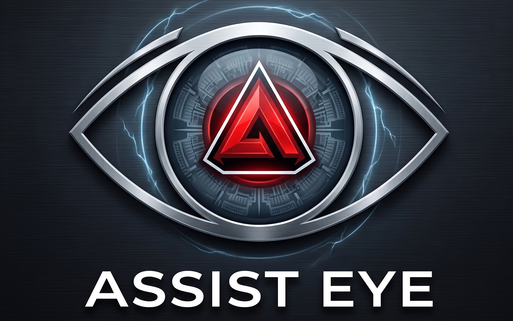

# Project-Assist-Ai

  

project-assist-ai is a generative AI assistant designed to bridge the gap between technical documentation and real-world problems. By combining computer vision, Agentic RAG (Retrieval-Augmented Generation), and autonomous web research, this tool allows users to show a problem to their computer and receive expert, grounded guidance just like having a master mechanic looking over your shoulder.
